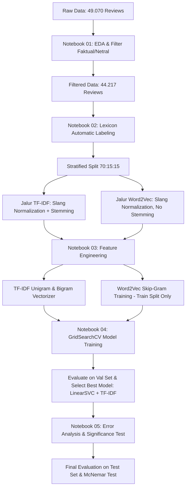

# Analisis Emosi Multi-Kelas pada Ulasan Aplikasi Twitter/X di Google Play Store
> **Studi Komparatif Ekstraksi Fitur TF-IDF vs. Word2Vec Menggunakan Algoritma Machine Learning Tradisional**

[](https://www.python.org/)
[](https://scikit-learn.org/)
[](https://radimrehurek.com/gensim/)

---

## 1. Project Overview (Deskripsi Proyek)

### Latar Belakang & Masalah
Ulasan pengguna pada Google Play Store merupakan sumber data umpan balik yang sangat berharga bagi pengembang aplikasi. Namun, analisis sentimen tradisional yang menyederhanakan opini menjadi polaritas **Positif, Negatif, atau Netral** sering kali gagal menangkap kompleksitas psikologis di balik teks ulasan. Sebagai contoh, keluhan teknis yang memicu emosi **Anger (Marah)** (misal: akun ditangguhkan secara sepihak) membutuhkan penanganan sistemik yang berbeda dibandingkan luapan kekecewaan bermakna **Disgust (Muak)** akibat spamming iklan.

### Definisi Analisis Emosi
Analisis emosi (*Emotion Analysis*) adalah cabang pemrosesan bahasa alami (NLP) yang berfokus pada klasifikasi teks ke dalam kategori emosi yang lebih spesifik. Proyek ini mengimplementasikan klasifikasi emosi multi-kelas (5 kelas) berdasarkan klasifikasi psikologis dasar, yaitu:
* **Joy (Senang)**
* **Anger (Marah)**
* **Sadness (Sedih)**
* **Fear (Takut)**
* **Disgust (Muak)**

### Sasaran & Objektif
Objektif utama penelitian ini adalah membangun pipeline pemrosesan teks modular dan membandingkan secara komparatif efektivitas representasi fitur berbasis frekuensi leksikal (**TF-IDF unigram & bigram**) terhadap representasi semantik berbasis vektor kontinu (**Word2Vec Skip-Gram**) untuk mengklasifikasi emosi ulasan aplikasi Twitter/X berbahasa Indonesia.

---

## 2. Why This Project (Urgensi & Pertanyaan Penelitian)

### Pertanyaan Penelitian (Research Questions)
1. *Apakah representasi semantik kontinu (Word2Vec) mampu melampaui keandalan representasi frekuensi kata tradisional (TF-IDF) dalam memodelkan ulasan pendek yang kaya akan bahasa slang informal?*
2. *Bagaimana pengaruh pembobotan TF-IDF terhadap embedding dokumen Word2Vec (Weighted Average) dibandingkan dengan perataan sederhana (Simple Average)?*
3. *Algoritma machine learning tradisional manakah yang paling kokoh dalam menangani ruang fitur dimensi tinggi yang dihasilkan dari teks ulasan informal?*

### Justifikasi Metodologis
* **TF-IDF vs. Word2Vec:** TF-IDF bertindak sebagai representasi leksikal yang sensitif terhadap kata kunci emosi eksplisit (*sparse representation*). Word2Vec bertindak sebagai representasi terdistribusi (*dense representation*) yang mampu menangkap kesamaan semantik kontekstual (misal: menyadari bahwa *"kesel"* dan *"marah"* berada di ruang vektor yang berdekatan meskipun karakternya berbeda).
* **Pemilihan Machine Learning Tradisional:** Dengan volume data latih sekitar 30.000 ulasan setelah penyaringan, algoritma tradisional (seperti SVM dan Logistic Regression) dinilai lebih efisien secara komputasi, terhindar dari risiko *overfitting* ekstrem pada model Deep Learning (seperti LSTM atau Transformer tanpa pre-training), dan menawarkan interpretasi bobot fitur yang jauh lebih transparan.

---

## 3. Methodology (Penjelasan Pipeline)



### 3.1 Pemuatan & Penyaringan Data (Notebook 01)
* **Penyaringan Faktual/Netral:** Ulasan yang tidak mengandung ekspresi emosi (misalnya ulasan berita faktual atau teks kosong) disaring keluar. Sistem membatasi ulasan berdasarkan rating ekstrem (rating 1 & 2 diasosiasikan dengan emosi negatif, rating 5 dengan emosi positif) untuk memastikan data memiliki sinyal emosi yang kuat.

### 3.2 Pelabelan Leksikon & Pra-pengolahan (Notebook 02)
* **Pelabelan Otomatis Leksikon:** Karena keterbatasan anotasi manual, pelabelan dilakukan otomatis menggunakan kamus emosi hibrida bahasa Indonesia dengan menerapkan aturan hirarki prioritas konflik emosi negatif: `Anger > Sadness > Disgust > Fear > Joy`.
* **Pra-pengolahan Teks Bercabang:**
  * **Jalur TF-IDF:** Menggunakan normalisasi slang, penghapusan stopword terbatas, dan **Stemming** (menggunakan PySastrawi). Stemming sangat krusial untuk TF-IDF guna mereduksi variasi morfologi kata bahasa Indonesia ke bentuk dasarnya (misal: *"kecewa"*, *"mengecewakan"*, *"dikecewakan"* disatukan menjadi *"kecewa"*), sehingga mengurangi *sparsity* fitur.
  * **Jalur Word2Vec:** Hanya menggunakan normalisasi slang tanpa stemming. Word2Vec bergantung pada konteks sintaksis di sekitar kata; stemming yang berlebihan akan merusak informasi imbuhan dan struktur tata bahasa asli yang penting untuk membentuk vektor semantik kata.

### 3.3 Ekstraksi Fitur (Notebook 03)
* **TF-IDF (Unigram + Bigram):** Unigram mendeteksi kata emosi tunggal, sedangkan Bigram mendeteksi negasi (misal: *"tidak kecewa"*) atau penguat makna (misal: *"jelek banget"*).
* **Word2Vec Skip-Gram (Kustom):** Melatih arsitektur Skip-Gram secara mandiri dengan parameter `vector_size=100`, `window=5`, dan `min_count=2`. Skip-Gram dipilih karena kemampuannya memodelkan kata-kata yang jarang muncul (*rare words*) secara lebih akurat pada korpus ulasan Play Store. Vektor dokumen dihitung dengan dua variasi:
  * **Simple Average:** Rata-rata aritmatika dari seluruh vektor kata dalam ulasan.
  * **TF-IDF Weighted Average:** Rata-rata tertimbang di mana vektor kata dikalikan dengan bobot TF-IDF kata tersebut sebelum dirata-ratakan, sehingga kata-kata penting yang jarang muncul mendapatkan pengaruh lebih besar pada representasi dokumen.

### 3.4 Pelatihan Model & Optimasi (Notebook 04)
Algoritma yang dievaluasi meliputi **Logistic Regression**, **LinearSVC**, **Complement Naive Bayes (CNB)**, dan **Random Forest**. Optimasi parameter dijalankan menggunakan **GridSearchCV 5-Fold Stratified Cross Validation** dengan target performa **Macro F1-Score** untuk mencegah bias evaluasi akibat ketidakseimbangan kelas (*class imbalance*).

### 3.5 Analisis Eror & Verifikasi Ilmiah (Notebook 05)
Model terbaik dievaluasi secara akhir pada data uji (*Test set*). Tahapan ini mencakup pembuatan matriks konfusi ternormalisasi, matriks transisi kesalahan kuantitatif, analisis linguistik kesalahan (sarkasme/ambiguitas), serta pengujian signifikansi statistik menggunakan **Uji McNemar**.

---

## 4. Project Structure (Struktur Direktori)

```bash
emotion-analysis/
│
├── data/
│   ├── raw/                  # Dataset ulasan mentah hasil scraping (.csv)
│   └── processed/            # File data hasil filter, pelabelan, dan pembagian split (.csv)
│
├── src/                      # Modul python modular pembantu
│   ├── data_utils.py         # Logika penyaringan ulasan netral/faktual
│   ├── preprocessing.py      # Dual preprocessing pipeline & aturan leksikon
│   ├── modeling.py           # Inisialisasi model ML, grid search, dan fungsi evaluasi
│   └── evaluation.py         # Visualisasi confusion matrix & matriks eror
│
├── notebooks/                # Jupyter Notebook alur kerja berurutan
│   ├── 01_eda_and_filtering.ipynb
│   ├── 02_preprocessing.ipynb
│   ├── 03_feature_extraction.ipynb
│   ├── 04_model_training.ipynb
│   └── 05_error_analysis.ipynb
│
├── models/                   # Berkas model dan representasi vektor yang terlatih (.joblib & .model)
└── reports/figures/          # File ekspor visualisasi grafik untuk paper/laporan (.png)
```

---

## 5. How to Run (Panduan Reproduksi)

### 5.1 Prasyarat System
* Python versi **3.12** atau di atasnya.
* Virtual environment (sangat direkomendasikan).

### 5.2 Instalasi Dependensi
Jalankan terminal di direktori proyek dan pasang seluruh pustaka yang diperlukan:
```bash
pip install -r requirements.txt
```

### 5.3 Langkah Eksekusi Pipeline
Jalankan Jupyter Notebook di folder `notebooks/` secara berurutan:
1. **`01_eda_and_filtering.ipynb`**: Memproses data mentah di `data/raw/` dan menghasilkan file `filtered_reviews.csv` di `data/processed/`.
2. **`02_preprocessing.ipynb`**: Melakukan pelabelan leksikon, pembagian data split, pembersihan slang, dan menghasilkan dataset latih/uji.
3. **`03_feature_extraction.ipynb`**: Melatih Word2Vec kustom pada data latih serta mengekstrak seluruh matriks fitur.
4. **`04_model_training.ipynb`**: Melakukan GridSearchCV untuk mencari parameter terbaik dan mengekspor model terpilih ke folder `models/`.
5. **`05_error_analysis.ipynb`**: Menghasilkan evaluasi akhir set uji, matriks konfusi, hasil uji signifikansi statistik McNemar, serta demo prediksi teks kustom.

---

## 6. Experiment Design (Desain Eksperimen)

### Strategi Pembagian Data
Untuk menjamin hasil evaluasi yang valid secara ilmiah dan bebas dari bias seleksi, dataset dibagi menjadi tiga bagian menggunakan **Stratified Split**:
* **Data Latih (Train Set - 70%)**: Untuk fitting model dan pencarian parameter.
* **Data Validasi (Val Set - 15%)**: Untuk mengevaluasi GridSearchCV dan memilih konfigurasi model-fitur terbaik.
* **Data Uji (Test Set - 15%)**: Ditahan sepenuhnya dari proses pelatihan dan hanya digunakan untuk evaluasi akhir.

### Uji Coba Adil (Fair Comparison Setup)
* Seluruh eksperimen menggunakan generator bilangan acak yang dikunci (`random_state=42`) pada pemisahan data, inisialisasi model, dan pelatihan Word2Vec.
* Metrik optimasi utama adalah **Macro F1-Score**, yang menghitung F1-score secara independen untuk setiap kelas kemudian merata-ratakannya. Metrik ini memberikan bobot yang setara untuk kelas mayoritas (*Fear*, *Joy*) maupun kelas minoritas (*Anger*).

### Pencegahan Kebocoran Data (Leakage Prevention)
* Word2Vec Skip-Gram dilatih **hanya** pada bagian *Train set*. Vektor representasi untuk set validasi dan set uji diperoleh dengan menerapkan inference (*lookup*) pada model Word2Vec yang sudah terkunci. Hal ini mencegah masuknya informasi semantik dari data uji ke dalam proses pelatihan model.

---

## 7. Results Summary (Hasil Performa Model)

### Tabel Perbandingan Performa Eksperimen (10 Konfigurasi)
Berikut adalah tabel komparasi performa model dari hasil eksperimen riil (diurutkan berdasarkan skor Macro F1 pada data uji):

| Model | Fitur | Val Macro F1 | Test Macro F1 | Akurasi Uji |
| :--- | :--- | :---: | :---: | :---: |
| **LinearSVC** | **TF-IDF** | **0.941** | **0.941** | **96.75%** |
| Logistic Regression | TF-IDF | 0.928 | 0.933 | 96.09% |
| Random Forest | TF-IDF | 0.851 | 0.847 | 89.37% |
| Complement Naive Bayes | TF-IDF | 0.822 | 0.834 | 89.59% |
| LinearSVC | Word2Vec (Average) | 0.790 | 0.799 | 87.07% |
| Logistic Regression | Word2Vec (Average) | 0.775 | 0.786 | 85.79% |
| LinearSVC | Word2Vec (Weighted) | 0.715 | 0.720 | 80.90% |
| Logistic Regression | Word2Vec (Weighted) | 0.700 | 0.706 | 78.93% |
| Random Forest | Word2Vec (Average) | 0.695 | 0.698 | 79.22% |
| Random Forest | Word2Vec (Weighted) | 0.649 | 0.652 | 75.13% |

* **Catatan Koreksi Kebocoran Data (Leak-free Word2Vec):** Nilai performa representasi Word2Vec pada eksperimen terdahulu tampak lebih tinggi (sekitar 85%) karena adanya *transductive leakage* (pelatihan Skip-Gram melibatkan set validasi dan set uji). Setelah kebocoran diperbaiki dengan membatasi pelatihan Word2Vec Skip-Gram secara induktif hanya pada data latih (*train split*), performa riil model berbasis Word2Vec berada pada kisaran **79.90%** (untuk Average) dan **72.00%** (untuk Weighted), yang secara valid menempatkan fitur **TF-IDF** sebagai pemenang mutlak untuk dataset ulasan pendek ini.

### Detail Performa Model Terbaik per Kelas (LinearSVC + TF-IDF)
Rincian metrik evaluasi per-kelas emosi pada data uji:

| Kelas Emosi | Precision | Recall | F1-Score | Jumlah Sampel (Support) |
| :--- | :---: | :---: | :---: | :---: |
| **Joy** | 0.98 | 0.98 | 0.98 | 926 |
| **Anger** | 0.93 | 0.89 | 0.91 | 149 |
| **Sadness** | 0.90 | 0.94 | 0.92 | 247 |
| **Fear** | 0.99 | 0.99 | 0.99 | 1163 |
| **Disgust** | 0.92 | 0.90 | 0.91 | 253 |
| **Rata-rata Makro (Macro Avg)** | **0.94** | **0.94** | **0.94** | **2738** |
| **Akurasi Akhir (Accuracy)** | | | **0.97** | **2738** |

### Uji Signifikansi Statistik (McNemar's Test)
Uji McNemar (exact binomial test) membandingkan model terbaik (**LinearSVC + TF-IDF**) terhadap model peringkat kedua (**Logistic Regression + TF-IDF**):
* **Tabel Kontingensi:**
  * Kedua model memprediksi benar: 2542 sampel
  * Model 1 benar, Model 2 salah (b): 107 sampel
  * Model 2 benar, Model 1 salah (c): 29 sampel
  * Kedua model memprediksi salah: 60 sampel
* **Nilai p-value:** 0.000000 (p < 0.05)
* **Kesimpulan:** Perbedaan performa antara LinearSVC dan Logistic Regression adalah **signifikan secara statistik**. Keunggulan LinearSVC bukan disebabkan oleh variasi data split, melainkan merupakan margin performa yang valid.

### Simulasi Hasil Prediksi Teks Kustom
Berikut adalah simulasi uji coba kemampuan inferensi model terbaik (**LinearSVC + TF-IDF**) secara langsung terhadap beberapa kalimat ulasan kustom baru:

| No. | Ulasan Masukan (Input) | Hasil Preprocessing | Prediksi Emosi | Distribusi Probabilitas |
| :---: | :--- | :--- | :---: | :--- |
| 1 | "aplikasinya jelek banget, tiap buka loading terus sering force close bikin emosi!" | "aplikasi jelek banget tiap buka loading terus sering force close bikin emosi" |  | **Anger: 98.43%**<br>Disgust: 0.40%<br>Fear: 0.21%<br>Joy: 0.56%<br>Sadness: 0.40% |
| 2 | "wah gokil sih fitur barunya keren banget memudahkan saya bersosialisasi makasih ya dev!" | "wah gokil fitur baru keren banget mudah sosial makasih ya dev" |  | Anger: 6.67%<br>Disgust: 8.47%<br>Fear: 13.24%<br>**Joy: 65.65%**<br>Sadness: 5.98% |
| 3 | "khawatir banget sama kebocoran data privasi apalagi ada berita akun di hack orang lain" | "khawatir banget sama bocor data privasi apalagi ada berita akun hack orang lain" |  | Anger: 4.81%<br>Disgust: 5.34%<br>**Fear: 80.40%**<br>Joy: 5.46%<br>Sadness: 4.00% |
| 4 | "sedih banget melihat akun saya tidak bisa dipulihkan, padahal banyak data penting di sana." | "sedih banget lihat akun tidak bisa pulih padahal banyak data penting sana" |  | Anger: 7.77%<br>Disgust: 6.06%<br>Fear: 9.13%<br>Joy: 6.06%<br>**Sadness: 70.99%** |
| 5 | "aplikasinya ampas, isinya cuma iklan, bot, sama spam yang mengganggu banget. uninstall aja lah." | "aplikasi ampas isi cuma iklan bot sama spam ganggu banget copot aja" |  | Anger: 21.22%<br>**Disgust: 76.11%**<br>Fear: 0.23%<br>Joy: 1.24%<br>Sadness: 1.20% |
| 6 | "woy respon dong admin! ini login gagal terus padahal koneksi internet lancar jaya!" | "woy respon dong admin login gagal terus padahal koneksi internet lancar jaya" |  | **Anger: 89.57%**<br>Disgust: 2.39%<br>Fear: 4.24%<br>Joy: 2.65%<br>Sadness: 1.14% |
| 7 | "terima kasih banyak dev, update kali ini keren abis, aplikasinya jadi lancar dan responsif sekali!" | "terima kasih banyak dev update kali keren abis aplikasi jadi lancar responsif sekali" |  | Anger: 20.36%<br>Disgust: 9.67%<br>Fear: 11.61%<br>**Joy: 32.08%**<br>Sadness: 26.28% |
| 8 | "was-was banget kalau mau masukin nomor hp, takut disalahgunakan buat penipuan." | "was-was banget kalau mau masukin nomor hp takut disalahgunakan buat tipu" |  | Anger: 24.84%<br>Disgust: 14.61%<br>**Fear: 37.58%**<br>Joy: 12.87%<br>Sadness: 10.11% |

---

## 8. Analysis & Insights (Analisis & Pembahasan)

### Mengapa TF-IDF Mengungguli Word2Vec?
1. **Karakteristik Teks Ulasan Pendek:** Ulasan Google Play Store cenderung singkat, padat, dan langsung menggunakan kata kunci emosional yang kuat (*"kecewa"*, *"bagus"*, *"jelek"*). Bobot IDF (Inverse Document Frequency) menaikkan skor kata kunci langka yang diskriminatif ini.
2. **Efek Pengenceran Informasi (Information Dilution):** Pada representasi rata-rata vektor (Average Word2Vec), vektor kata kunci emosi yang sangat kuat dicampur dan dirata-ratakan dengan vektor kata-kata netral lainnya dalam ulasan. Akibatnya, sinyal emosi menjadi terdistorsi. Upaya menggunakan pembobotan TF-IDF (Weighted Word2Vec) sedikit memperbaiki representasi, namun belum mampu melampaui keandalan spasial dari ruang fitur TF-IDF unigram+bigram.

### Analisis Kebingungan Emosi (Confusion Analysis)
Visualisasi dari matriks konfusi dan matriks transisi kesalahan mengindikasikan adanya kebingungan klasifikasi model yang kuat pada kelas **Anger** dan **Disgust**.
* **Penyebab Linguistik:** Pengguna sering kali menuliskan kemarahan (*Anger*) dan kejengkelan (*Disgust*) menggunakan kata-kata kasar yang tumpang tindih secara semantik (misalnya frasa *"aplikasi sampah"* atau *"kecewa banget sama update baru"*). Ketiadaan konteks intonasi suara membuat pemisahan kedua emosi negatif ini menjadi tantangan berat bagi model klasifikasi linear.

---

## 9. Limitations (Keterbatasan Penelitian)

1. **Sirkularitas Label Leksikon (Annotation Bias):** Mengingat *ground truth* dilabeli secara otomatis menggunakan pendekatan aturan kamus leksikon, model klasifikasi machine learning yang dilatih sebenarnya hanya mereplikasi aturan deterministik dari kamus tersebut. Performa akurasi 97.00% pada LinearSVC mencerminkan kemampuan model meniru leksikon, bukan representasi emosi kognitif manusia yang alami.
2. **Kebergantungan pada Kamus Slang:** Kualitas pembersihan teks sangat bergantung pada kelengkapan kamus slang normalisasi. Bahasa gaul internet Indonesia berkembang sangat cepat, sehingga kamus slang statis ini berisiko usang dalam waktu singkat.

---

## 10. Future Work (Rencana Lanjutan)

1. **Anotasi Data oleh Manusia (Human-in-the-Loop):** Mengganti pelabelan otomatis leksikon dengan anotasi manual oleh beberapa panel ahli bahasa (human annotators) dan menghitung nilai *Inter-Annotator Agreement* (seperti Cohen's Kappa atau Fleiss' Kappa) untuk membangun dataset acuan (*gold standard*) yang bebas bias.
2. **Penerapan Transformer (IndoBERT):** Melakukan *fine-tuning* pada model representasi bahasa berbasis Transformer yang telah dilatih sebelumnya untuk bahasa Indonesia (seperti IndoBERT atau IndoGPT) guna menangkap hubungan semantik kalimat yang lebih kompleks secara kontekstual.
3. **Analisis Sarkasme:** Menambahkan modul khusus pendeteksi sarkasme, mengingat sarkasme sering kali membalikkan polaritas emosi teks ulasan secara implisit.

---

## 11. References (Referensi Ilmiah)

1. Mikolov, T., Chen, K., Corrado, G., & Dean, J. (2013). *Efficient Estimation of Word Representations in Vector Space*. arXiv preprint arXiv:1301.3781.
2. McNemar, Q. (1947). *Note on the sampling error of the difference between correlated proportions or percentages*. Psychometrika, 12(2), 153-157.
3. Manning, C. D., Raghavan, P., & Schütze, H. (2008). *Introduction to Information Retrieval*. Cambridge University Press.
