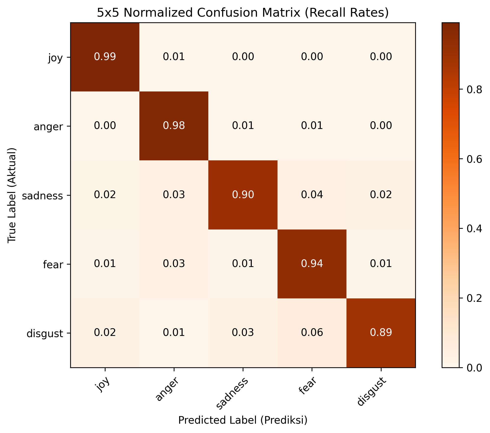

# Emotion Analysis using Machine Learning

This project builds models to classify text into emotions such as joy, anger, sadness, fear, etc., using Machine Learning approaches with a structured NLP pipeline.

---

## 1. Project Overview

Emotion analysis adalah pemodelan teks untuk mendeteksi emosi spesifik pengguna. Analisis ini berbeda dari analisis sentimen biasa (positif/negatif) karena mampu mengelompokkan teks ke dalam kategori emosi yang lebih detail. Proyek ini memilah ulasan pengguna aplikasi X di Google Play Store ke dalam 5 emosi dasar: Joy, Anger, Sadness, Fear, dan Disgust.

### Objectives
* Menyaring ulasan netral agar model fokus hanya pada teks yang membawa ekspresi emosional.
* Membandingkan performa representasi fitur TF-IDF unigram+bigram dengan Word2Vec Skip-Gram.
* Melatih beberapa model Machine Learning tradisional dan memilih algoritma terbaik melalui validasi silang.
* Menyediakan fitur inferensi untuk memprediksi emosi dari kalimat ulasan kustom baru.

---

## 2. Features

* Klasifikasi emosi multi-kelas (5 kategori emosi).
* Algoritma pemelajaran mesin (Logistic Regression, LinearSVC, Complement Naive Bayes, Random Forest).
* Pipeline pra-pengolahan dual-jalur (pembersihan slang, stemming khusus untuk TF-IDF, tanpa stemming untuk Word2Vec).
* Evaluasi performa model menggunakan metrik Macro F1-score dan matriks konfusi.

---

## 3. Project Structure

```bash
emotion-analysis/
│
├── data/
│   ├── raw/                  # Dataset ulasan mentah hasil scraping (.csv)
│   └── processed/            # File hasil filter emosi, pelabelan, dan pembagian split data (.csv)
│
├── notebooks/                # Jupyter Notebook alur kerja berurutan dari 01 s.d 05
│   ├── 01_eda_and_filtering.ipynb
│   ├── 02_preprocessing.ipynb
│   ├── 03_feature_extraction.ipynb
│   ├── 04_model_training.ipynb
│   └── 05_error_analysis.ipynb
│
├── src/                      # Berkas python modular pembantu
│   ├── data_utils.py         # Logika penyaringan ulasan non-emosional
│   ├── preprocessing.py      # Dual preprocessing pipeline (stemming vs no-stemming)
│   ├── modeling.py           # Pembuatan model GridSearchCV & fungsi evaluasi
│   └── evaluation.py         # Kode visualisasi confusion matrix & matriks eror
│
├── models/                   # Berkas model dan representasi vektor yang terlatih (.joblib & .model)
└── reports/figures/          # Seluruh gambar grafik ekspor visualisasi performa (.png)
```

### Penjelasan Folder
* data: Menyimpan ulasan mentah hasil scraping serta data latih/uji hasil pra-pengolahan.
* notebooks: Berisi 5 file Jupyter Notebook alur eksperimen dari awal hingga evaluasi akhir secara berurutan.
* src: Berisi kode pemroses utama (utility scripts) agar fungsi di dalam notebook tetap modular dan bersih.
* models: Menyimpan berkas biner model latih (.joblib) dan model Word2Vec (.model) untuk inferensi.
* reports/figures: Menyimpan semua grafik visualisasi ekspor (seperti matriks konfusi dan perbandingan kinerja).

---

## 4. Installation

Sistem memerlukan Python versi 3.12 atau di atasnya.

```bash
# 1. Clone repositori proyek
git clone https://github.com/Rakanovan9/indonesian-reviews-emotion-analysis.git
cd indonesian-reviews-emotion-analysis

# 2. Buat environment virtual
python -m venv venv

# 3. Aktifkan environment virtual
# Untuk Windows:
.\venv\Scripts\activate
# Untuk macOS/Linux:
source venv/bin/activate

# 4. Pasang pustaka dependensi
pip install -r requirements.txt
```

---

## 5. Usage

Jalankan berkas Jupyter Notebook secara berurutan:
1. Jalankan `notebooks/01_eda_and_filtering.ipynb` untuk menyaring ulasan faktual/netral.
2. Jalankan `notebooks/02_preprocessing.ipynb` untuk pelabelan otomatis leksikon dan pembagian data split.
3. Jalankan `notebooks/03_feature_extraction.ipynb` untuk mengekstrak fitur TF-IDF dan melatih Word2Vec.
4. Jalankan `notebooks/04_model_training.ipynb` untuk proses GridSearchCV pencarian parameter terbaik.
5. Jalankan `notebooks/05_error_analysis.ipynb` untuk evaluasi akhir set uji dan uji coba prediksi kustom.

Eksekusi pipeline otomatis melalui terminal:
```bash
jupyter nbconvert --to notebook --execute --inplace notebooks/*.ipynb
```

---

## 6. Methodology

* **Filtering non-emotional text:** Membuang ulasan netral agar model hanya mempelajari teks yang memiliki ekspresi emosional kuat ( rating ekstrem 1, 2, dan 5).
* **Preprocessing:** Pembersihan noise, normalisasi kata slang, dan standardisasi teks agar input yang masuk ke model seragam.
* **Dual pipeline (stemming vs no-stemming):** TF-IDF memerlukan stemming untuk menyatukan variasi infleksi kata dasarnya, sedangkan Word2Vec dilatih tanpa stemming agar makna tata bahasa dan struktur kata di sekitarnya tetap terjaga.
* **Feature extraction (TF-IDF):** Bertindak sebagai representasi leksikal sparse unigram+bigram yang sangat sensitif terhadap kata kunci emosi kunci yang eksplisit.
* **Model training (ML models + GridSearchCV):** Menjalankan pencarian parameter terbaik dengan 5-Fold Stratified Cross Validation untuk mencegah overfitting.
* **Evaluation:** Menggunakan matriks konfusi untuk melihat pola salah klasifikasi antar emosi secara transparan.

---

## 7. Results

Berikut perbandingan performa ke-10 model yang diuji (diurutkan berdasarkan skor Macro F1 set uji):

| Model | Fitur | Val Macro F1 | Test Macro F1 | Akurasi Uji |
| :--- | :--- | :---: | :---: | :---: |
| LinearSVC | TF-IDF | 0.941 | 0.941 | 96.75% |
| Logistic Regression | TF-IDF | 0.928 | 0.933 | 96.09% |
| Random Forest | TF-IDF | 0.851 | 0.847 | 89.37% |
| Complement Naive Bayes | TF-IDF | 0.822 | 0.834 | 89.59% |
| LinearSVC | Word2Vec (Average) | 0.790 | 0.799 | 87.07% |
| Logistic Regression | Word2Vec (Average) | 0.775 | 0.786 | 85.79% |
| LinearSVC | Word2Vec (Weighted) | 0.715 | 0.720 | 80.90% |
| Logistic Regression | Word2Vec (Weighted) | 0.700 | 0.706 | 78.93% |
| Random Forest | Word2Vec (Average) | 0.695 | 0.698 | 79.22% |
| Random Forest | Word2Vec (Weighted) | 0.649 | 0.652 | 75.13% |



* **Model Terbaik:** LinearSVC dengan representasi TF-IDF adalah yang terbaik. Ulasan Play Store yang pendek sangat mengandalkan kemunculan langsung kata kunci emosi kunci, yang dibobotkan secara kuat oleh TF-IDF dan dipisahkan dengan optimal oleh hyperplane linear SVM.

---

## 8. Example Predictions

Hasil inferensi langsung model terbaik (LinearSVC + TF-IDF) terhadap kalimat kustom baru:

* **Masukan:** "Aku sangat senang hari ini!"
  **Prediksi:** JOY
* **Masukan:** "Pelayanannya buruk sekali."
  **Prediksi:** ANGER
* **Masukan:** "khawatir banget sama kebocoran data privasi apalagi ada berita akun di hack orang lain"
  **Prediksi:** FEAR
* **Masukan:** "sedih banget melihat akun saya tidak bisa dipulihkan, padahal banyak data penting di sana."
  **Prediksi:** SADNESS
* **Masukan:** "aplikasinya ampas, isinya cuma iklan, bot, sama spam yang mengganggu banget. uninstall aja lah."
  **Prediksi:** DISGUST

---

## 9. Error Analysis

* Kesalahan klasifikasi terbesar terjadi antara emosi Anger (Marah) dan Disgust (Muak) karena kemiripan leksikal keluhan pengguna (misal frasa "aplikasi ampas" atau "kecewa banget").
* Model gagal mendeteksi kalimat sarkasme (misal ulasan "aplikasinya bagus banget, tiap buka langsung crash" diprediksi sebagai JOY karena adanya token "bagus banget").

---

## 10. Key Insights

* **TF-IDF Unggul Mutlak:** Representasi TF-IDF mengalahkan Word2Vec Skip-Gram pada ulasan pendek karena menghindari pengenceran informasi semantik saat vektor kata dirata-ratakan.
* **Pentingnya Stemming pada TF-IDF:** Penerapan stemming sangat menolong performa TF-IDF untuk menyatukan variasi kata, sementara Word2Vec berkinerja lebih baik tanpa stemming.
* **Optimasi Parameter Penyeimbang:** Penyetelan penyeimbang bobot kelas otomatis pada model linear membantu menaikkan keakurasi prediksi pada kelas minoritas (Anger).

---

## 11. Future Work

* Menambah volume data ulasan secara manual untuk kelas emosi minoritas.
* Melakukan fine-tuning model representasi bahasa Transformer seperti IndoBERT.
* Mengembangkan modul pendeteksi kalimat sarkasme implisit.

---

## 12. Author

Rakanovan

---

## 13. License

MIT License
