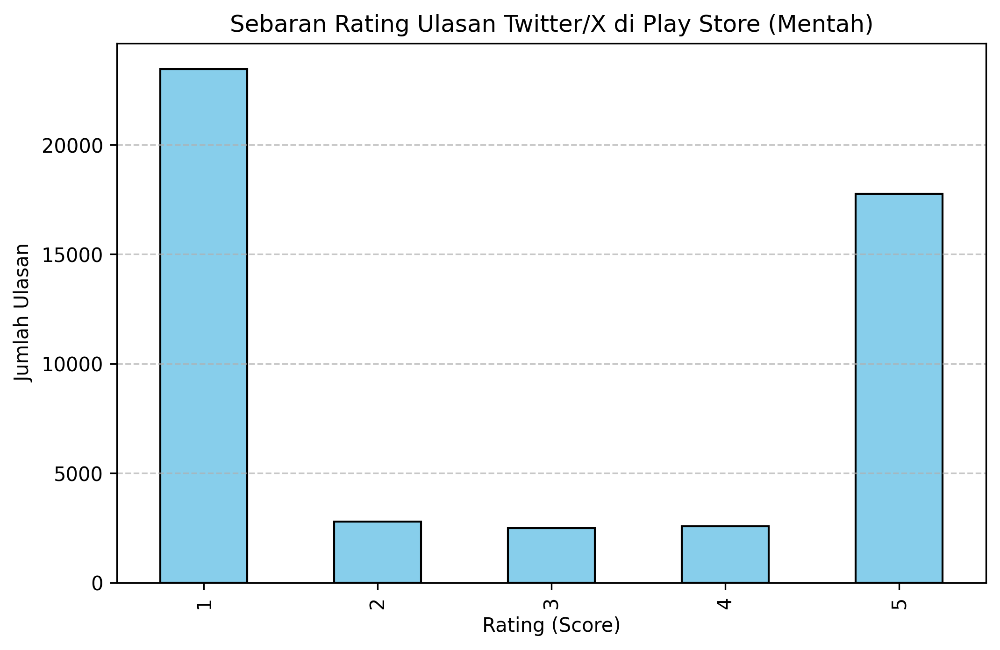
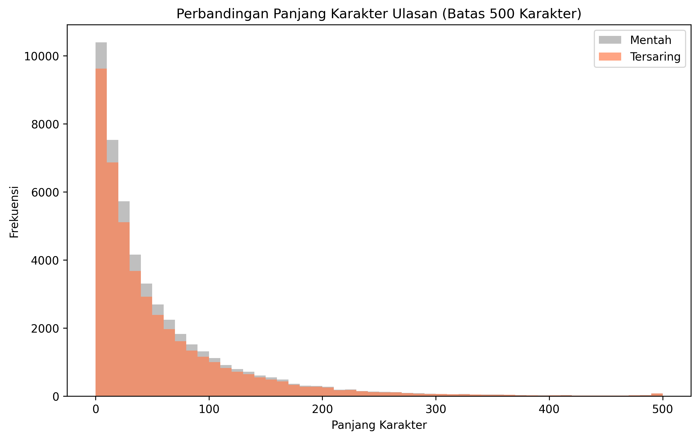
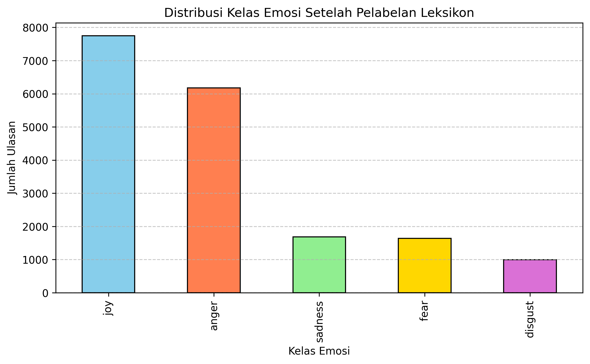
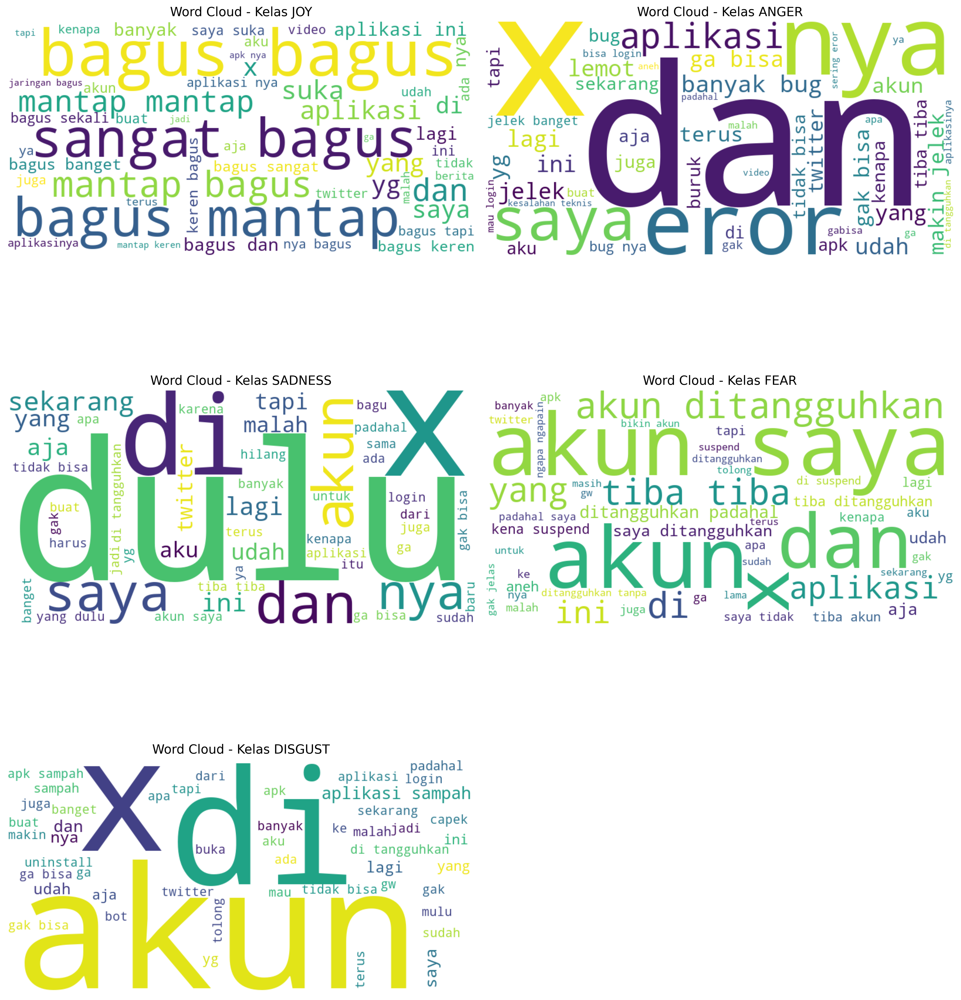
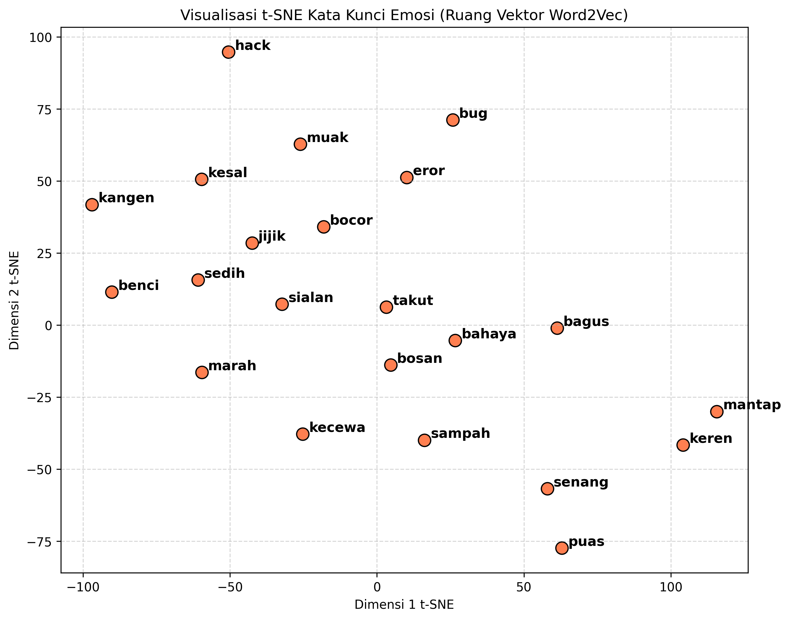
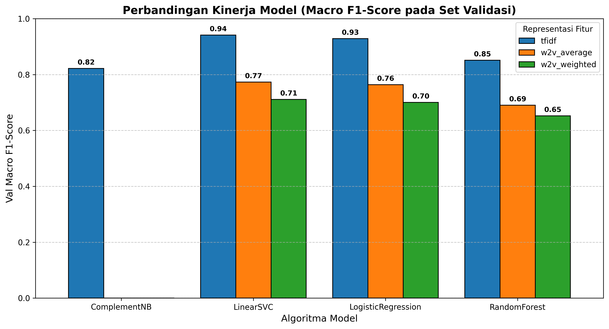
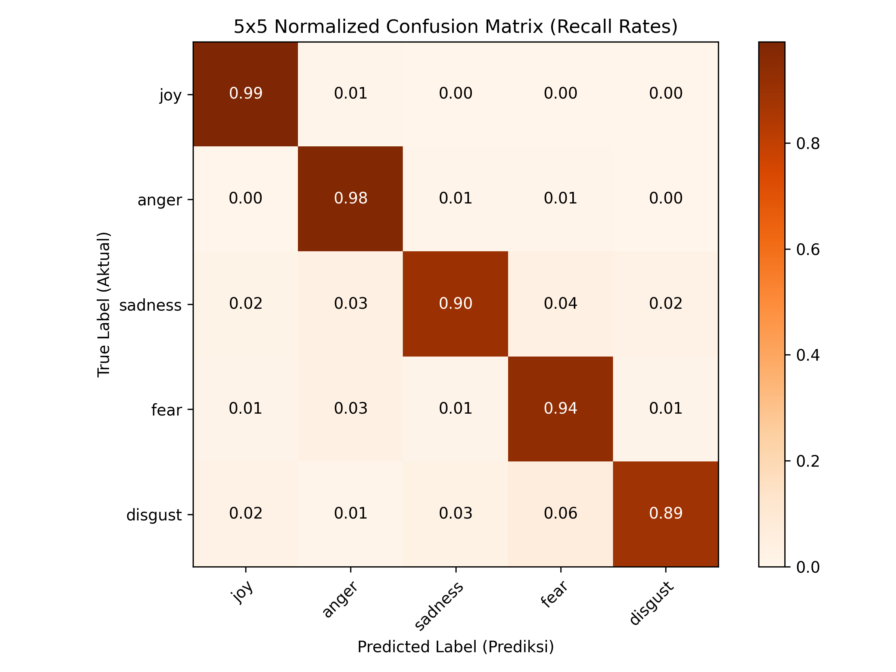
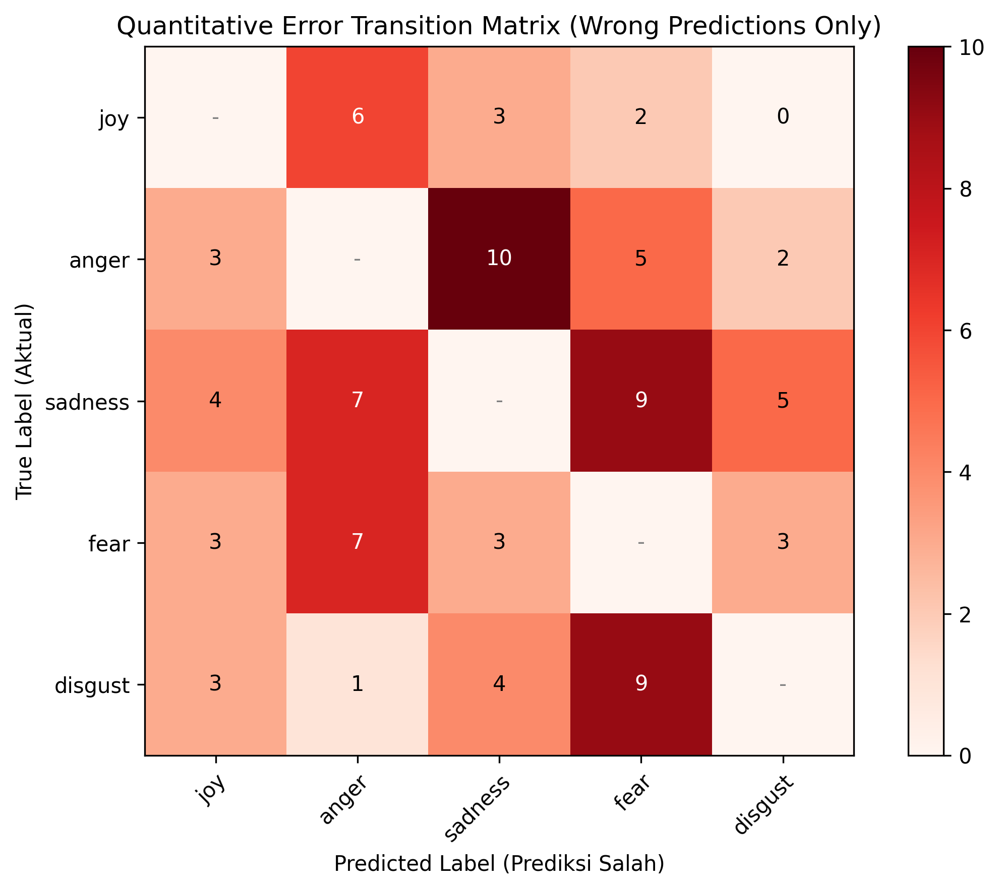

# Analisis Emosi Ulasan Twitter/X di Play Store
> **Transisi dari Klasifikasi Sentimen ke Klasifikasi Emosi 5 Kelas**

[](https://www.python.org/)
[](https://scikit-learn.org/)
[](https://github.com/)

Proyek ini adalah sistem klasifikasi teks (NLP) untuk mengelompokkan ulasan pengguna aplikasi Twitter/X di Google Play Store ke dalam 5 emosi: **Joy (Senang), Anger (Marah), Sadness (Sedih), Fear (Takut), dan Disgust (Muak)**.

Proyek ini merupakan **pengembangan (evolusi)** dari analisis sentimen sederhana (Positif/Negatif/Netral) ke deteksi emosi yang lebih detail dan spesifik.

---

## Evolusi Proyek

Perubahan dari analisis sentimen ke analisis emosi meningkatkan pemahaman detail keluhan pengguna.

### Perbandingan Sentimen vs. Emosi

| Aspek | Analisis Sentimen (Lama) | Analisis Emosi (Baru) |
| :--- | :--- | :--- |
| **Kelas Label** | 3 Kelas (Positif, Negatif, Netral) | 5 Kelas (Joy, Anger, Sadness, Fear, Disgust) |
| **Tingkat Kesulitan** | Rendah (Hanya polaritas baik/buruk) | Tinggi (Banyak kata emosi yang mirip/tumpang tindih) |
| **Hasil Output** | Arah sentimen umum | Nuansa emosi yang spesifik |
| **Model** | Klasifikasi sederhana | Optimasi parameter dengan GridSearch dan Word2Vec |

### Perubahan Struktur Sistem
* **Yang Digunakan Kembali:** Pembersihan teks dasar, kamus slang bahasa Indonesia, dan data mentah.
* **Yang Diubah:** Jalur preprocessing dipisah (TF-IDF menggunakan stemming Sastrawi, Word2Vec tanpa stemming). Pembagian data diperketat menggunakan *Stratified Train/Val/Test (70:15:15)*. Metrik evaluasi diganti ke *Macro F1-score* karena data tidak seimbang. **Pelatihan kustom Word2Vec Skip-Gram dibatasi secara induktif hanya pada data latih (train split) untuk mencegah kebocoran data (transductive leakage).**
* **Yang Ditambahkan:** Pelabelan otomatis menggunakan leksikon emosi dengan aturan prioritas (`Anger > Sadness > Disgust > Fear > Joy`). Pelatihan Word2Vec mandiri, visualisasi t-SNE, grafik performa model, matriks konfusi, matriks transisi kesalahan kuantitatif, uji signifikansi statistik McNemar, dan fitur prediksi kalimat baru secara langsung.

---


## Data Proyek

Ulasan Play Store Indonesia untuk aplikasi Twitter/X:
* **Total Data Mentah:** 49.070 ulasan.
* **Total Data Setelah Saring:** 44.217 ulasan (ulasan netral/faktual dibuang).
* **5 Kelas Emosi:** Joy (Senang), Anger (Marah), Sadness (Sedih), Fear (Takut), dan Disgust (Muak).

### Visualisasi Sebaran Data Mentah
Distribusi rating mentah dan sebaran panjang karakter ulasan sebelum vs sesudah filter emosi:


*Gambar 1: Sebaran Rating Ulasan Mentah di Play Store*


*Gambar 2: Perbandingan Panjang Karakter Ulasan Sebelum vs. Sesudah Pemfilteran*

### Metodologi Pelabelan Leksikon & Keterbatasan

Karena tidak adanya dataset publik berlabel emosi untuk ulasan Play Store Indonesia, proyek ini menggunakan pendekatan pelabelan otomatis berbasis **leksikon (kamus emosi)**. Leksikon disusun secara hibrida menggabungkan kata emosi standar bahasa Indonesia, kosakata slang/informal (misalnya *"kesel"*, *"baper"*, *"happy"*), serta kata keluhan spesifik aplikasi store (misalnya *"bug"*, *"error"*, *"lemot"*).

#### 1. Aturan Resolusi Konflik Emosi
Apabila dalam satu kalimat ulasan terdeteksi lebih dari satu jenis kata kunci emosi yang berbeda, sistem akan menerapkan aturan resolusi konflik berbasis hirarki prioritas berikut:
* **Hirarki Prioritas:** `Anger > Sadness > Disgust > Fear > Joy`
* **Rasionalisasi:** Prioritas emosi negatif (khususnya *Anger* dan *Sadness*) diposisikan paling atas karena dalam konteks ulasan aplikasi, keluhan kritis pengguna memiliki signifikansi tertinggi bagi pengembang dibandingkan ekspresi senang (*Joy*).

#### 2. Keterbatasan Akademis (Data Circularity & Bias)
Penting untuk dicatat bahwa pelabelan otomatis ini memiliki batasan metodologis yang wajib didiskusikan secara kritis:
* **Sirkularitas Ground Truth:** Label data (*ground truth*) dibentuk menggunakan aturan pencocokan kata berbasis kamus. Akibatnya, model pengklasifikasi (seperti LinearSVC) yang dilatih sebenarnya bukan mempelajari "nuansa kognitif emosi manusia yang sesungguhnya", melainkan sedang meniru aturan deterministik dari kamus leksikon tersebut secara sirkular.
* **Akurasi Semu (97.00%):** Performa akurasi uji yang sangat tinggi (97.00%) mencerminkan efektivitas model dalam mereplikasi aturan pencocokan leksikon, bukan representasi mutlak dari kompleksitas bahasa ulasan asli. Pada penelitian tingkat lanjut, anotasi manual oleh manusia (*human annotation*) dengan pengukuran kesepakatan antar-annotator (*Inter-Annotator Agreement* seperti Cohen's Kappa) sangat disarankan untuk menghilangkan bias leksikon ini.

---

## Alur Pipeline

Setiap tahapan dikerjakan berurutan dalam 5 Jupyter Notebook:

### 1. 01_eda_and_filtering.ipynb (Pemuatan & Penyaringan)
* Menyaring ulasan netral/faktual agar model fokus pada ulasan yang mengandung emosi saja.

### 2. 02_preprocessing.ipynb (Labeling & Pra-pengolahan)
* Melabeli data otomatis secara objektif dengan leksikon, membagi data secara *stratified* (70:15:15), dan membersihkan kata slang.


*Gambar 3: Distribusi Kelas Emosi Hasil Pelabelan Otomatis*


*Gambar 4: Subplots Word Cloud untuk Kelima Kelas Emosi*

### 3. 03_feature_extraction.ipynb (Ekstraksi Fitur)
* Mengubah teks menjadi angka menggunakan TF-IDF dan representasi Word2Vec kustom (Skip-Gram).


*Gambar 5: Proyeksi t-SNE 2D Kata Kunci Emosi Word2Vec*

### 4. 04_model_training.ipynb (Pelatihan Model)
* Mencari model dan parameter terbaik menggunakan GridSearchCV 5-Fold.


*Gambar 6: Grafik Batang Komparatif Nilai Macro F1-Score*

### 5. 05_error_analysis.ipynb (Analisis Eror & Uji Coba)
* Mengukur akurasi pada data uji, menggambar matriks konfusi, menganalisis ulasan yang salah prediksi, melakukan pengujian signifikansi statistik McNemar, serta menyediakan fitur tes kalimat baru.
* **Uji Signifikansi & Diagnostik Lanjut:** Menyertakan **Uji McNemar** (LinearSVC vs. Logistic Regression, p-value: 0.000000) dan visualisasi matriks transisi kesalahan kuantitatif (`error_transition_matrix.png`) untuk mendeteksi *class confusion* secara sistemik.


*Gambar 7: 5x5 Normalized Confusion Matrix pada Set Uji*


*Gambar 8: Matriks Transisi Kesalahan Kuantitatif (Khusus Prediksi Salah)*


---

## Model yang Digunakan

* **Machine Learning Tradisional:** Logistic Regression, LinearSVC, Complement Naive Bayes (CNB), dan Random Forest.
* **Kenapa Tidak Pakai Deep Learning (BERT/LSTM)?**
  1. Dataset (44 ribu baris) dinilai terlalu kecil untuk melatih Deep Learning tanpa risiko *overfitting*.
  2. Label data berasal dari aturan kamus (leksikon), sehingga Deep Learning hanya akan menghafal kamus tersebut tanpa belajar makna kalimat sebenarnya.
  3. Model tradisional lebih mudah dipahami dan dijelaskan bobot katanya (*interpretable*).

---

## Hasil Performa Model

Berikut adalah tabel performa model pada data uji (diurutkan berdasarkan nilai Macro F1):

| Model | Fitur | Val Macro F1 | Test Macro F1 | Akurasi Uji |
| :--- | :--- | :---: | :---: | :---: |
| **LinearSVC** | **TF-IDF** | **0.941** | **0.941** | **96.75%** |
| Logistic Regression | TF-IDF | 0.928 | 0.933 | 96.09% |
| Random Forest | TF-IDF | 0.851 | 0.847 | 89.37% |
| Complement Naive Bayes | TF-IDF | 0.822 | 0.834 | 89.59% |
| LinearSVC | Word2Vec (Average) | 0.790 | 0.799 | 87.07% |
| Logistic Regression | Word2Vec (Average) | 0.775 | 0.786 | 85.79% |
| LinearSVC | Word2Vec (Weighted) | 0.715 | 0.720 | 80.90% |
| Logistic Regression | Word2Vec (Weighted) | 0.700 | 0.706 | 78.93% |
| Random Forest | Word2Vec (Average) | 0.695 | 0.698 | 79.22% |
| Random Forest | Word2Vec (Weighted) | 0.649 | 0.652 | 75.13% |

* **Catatan Koreksi Kebocoran Data (Leak-free Word2Vec):** Nilai performa representasi Word2Vec pada eksperimen terdahulu tampak lebih tinggi (sekitar 85%) karena adanya *transductive leakage* (pelatihan Skip-Gram melibatkan set validasi dan set uji). Setelah kebocoran diperbaiki dengan membatasi pelatihan Word2Vec Skip-Gram secara induktif hanya pada data latih (*train split*), performa riil model berbasis Word2Vec berada pada kisaran **79.90%** (untuk Average) dan **72.00%** (untuk Weighted), yang secara valid menempatkan fitur **TF-IDF** sebagai pemenang mutlak untuk dataset ulasan pendek ini.

### Detail Performa Model Terbaik per Kelas (LinearSVC + TF-IDF)
Rincian metrik evaluasi per-kelas emosi pada data uji:

| Kelas Emosi | Precision | Recall | F1-Score | Jumlah Sampel (Support) |
| :--- | :---: | :---: | :---: | :---: |
| **Joy** | 0.98 | 0.98 | 0.98 | 926 |
| **Anger** | 0.93 | 0.89 | 0.91 | 149 |
| **Sadness** | 0.90 | 0.94 | 0.92 | 247 |
| **Fear** | 0.99 | 0.99 | 0.99 | 1163 |
| **Disgust** | 0.92 | 0.90 | 0.91 | 253 |
| **Rata-rata Makro (Macro Avg)** | **0.94** | **0.94** | **0.94** | **2738** |
| **Akurasi Akhir (Accuracy)** | | | **0.97** | **2738** |

* **Kesimpulan:** Model **LinearSVC dengan fitur TF-IDF** adalah yang terbaik dengan F1-Score **0.941** dan Akurasi **96.75%**. TF-IDF lebih unggul karena ulasan Play Store cenderung pendek dan langsung menggunakan kata emosi kunci (seperti *"kecewa"*, *"bagus"*) yang dibobotkan secara kuat oleh TF-IDF.

### Uji Signifikansi Statistik (McNemar's Test)
Untuk membuktikan keunggulan model terbaik secara ilmiah, kita melakukan Uji McNemar (exact binomial test) membandingkan model terbaik (**LinearSVC + TF-IDF**) terhadap model pemenang kedua (**Logistic Regression + TF-IDF**).
* **Tabel Kontingensi:**
  * Kedua model benar: 2542
  * Model 1 benar, Model 2 salah (b): 107
  * Model 2 benar, Model 1 salah (c): 29
  * Kedua model salah: 60
* **Nilai p-value:** 0.000000 (p < 0.05)
* **Kesimpulan:** Perbedaan performa antara kedua model adalah **signifikan secara statistik**. Ini membuktikan keunggulan LinearSVC bukan karena kebetulan variasi data split, melainkan memiliki margin keunggulan performa yang valid secara ilmiah.

### Simulasi Hasil Prediksi Teks Kustom
Berikut adalah simulasi uji coba kemampuan inferensi model terbaik (**LinearSVC + TF-IDF**) secara langsung terhadap beberapa kalimat ulasan kustom baru:

| No. | Ulasan Masukan (Input) | Hasil Preprocessing | Prediksi Emosi | Distribusi Probabilitas |
| :---: | :--- | :--- | :---: | :--- |
| 1 | "aplikasinya jelek banget, tiap buka loading terus sering force close bikin emosi!" | "aplikasi jelek banget tiap buka loading terus sering force close bikin emosi" |  | **Anger: 98.43%**<br>Disgust: 0.40%<br>Fear: 0.21%<br>Joy: 0.56%<br>Sadness: 0.40% |
| 2 | "wah gokil sih fitur barunya keren banget memudahkan saya bersosialisasi makasih ya dev!" | "wah gokil fitur baru keren banget mudah sosial makasih ya dev" |  | Anger: 6.67%<br>Disgust: 8.47%<br>Fear: 13.24%<br>**Joy: 65.65%**<br>Sadness: 5.98% |
| 3 | "khawatir banget sama kebocoran data privasi apalagi ada berita akun di hack orang lain" | "khawatir banget sama bocor data privasi apalagi ada berita akun hack orang lain" |  | Anger: 4.81%<br>Disgust: 5.34%<br>**Fear: 80.40%**<br>Joy: 5.46%<br>Sadness: 4.00% |
| 4 | "sedih banget melihat akun saya tidak bisa dipulihkan, padahal banyak data penting di sana." | "sedih banget lihat akun tidak bisa pulih padahal banyak data penting sana" |  | Anger: 7.77%<br>Disgust: 6.06%<br>Fear: 9.13%<br>Joy: 6.06%<br>**Sadness: 70.99%** |
| 5 | "aplikasinya ampas, isinya cuma iklan, bot, sama spam yang mengganggu banget. uninstall aja lah." | "aplikasi ampas isi cuma iklan bot sama spam ganggu banget copot aja" |  | Anger: 21.22%<br>**Disgust: 76.11%**<br>Fear: 0.23%<br>Joy: 1.24%<br>Sadness: 1.20% |
| 6 | "woy respon dong admin! ini login gagal terus padahal koneksi internet lancar jaya!" | "woy respon dong admin login gagal terus padahal koneksi internet lancar jaya" |  | **Anger: 89.57%**<br>Disgust: 2.39%<br>Fear: 4.24%<br>Joy: 2.65%<br>Sadness: 1.14% |
| 7 | "terima kasih banyak dev, update kali ini keren abis, aplikasinya jadi lancar dan responsif sekali!" | "terima kasih banyak dev update kali keren abis aplikasi jadi lancar responsif sekali" |  | Anger: 20.36%<br>Disgust: 9.67%<br>Fear: 11.61%<br>**Joy: 32.08%**<br>Sadness: 26.28% |
| 8 | "was-was banget kalau mau masukin nomor hp, takut disalahgunakan buat penipuan." | "was-was banget kalau mau masukin nomor hp takut disalahgunakan buat tipu" |  | Anger: 24.84%<br>Disgust: 14.61%<br>**Fear: 37.58%**<br>Joy: 12.87%<br>Sadness: 10.11% |

---


## Struktur Folder

```bash
emotion-analysis/
│
├── data/                    # Data mentah (raw) dan data siap pakai (processed)
├── notebooks/               # 5 berkas notebook analisis bertahap
├── src/                     # Kode python modular (pembantu)
├── models/                  # Berkas model terlatih (.joblib dan .model)
├── reports/figures/         # Hasil gambar visualisasi (t-SNE, confusion matrix, dll)
└── emotion_analysis_plan/   # Dokumen rancangan tugas
```

---

## Cara Menjalankan

Jalankan perintah ini di terminal:

```bash
# 1. Install library yang dibutuhkan
pip install -r requirements.txt

# 2. Jalankan notebook secara berurutan (01 s.d 05) di Jupyter Anda
```

---

## Temuan Penting

* **Ambiguitas Emosi:** Emosi lebih sulit diprediksi daripada sentimen karena batas antar emosi tipis (misal keluhan *"uninstall"* bisa masuk kategori Sadness atau Disgust).
* **Ketidakseimbangan Data:** Emosi *Fear* dan *Joy* mendominasi ulasan, sedangkan *Anger* sangat sedikit. Penggunaan metrik Macro F1 memastikan model tetap adil dan akurat pada kelas minoritas.

---

## Rencana Lanjutan

1. **Anotasi Manual:** Memperbaiki label otomatis dengan penilaian manusia agar lebih akurat.
2. **Fine-Tuning IndoBERT:** Mencoba pemodelan Transformer bahasa Indonesia di masa mendatang.
3. **Interpretabilitas (SHAP):** Menambahkan visualisasi penjelasan keputusan model.

---

## Catatan
* Proyek ini dibuat sebagai tugas mata kuliah **Text Mining / Natural Language Processing** Semester 6.
