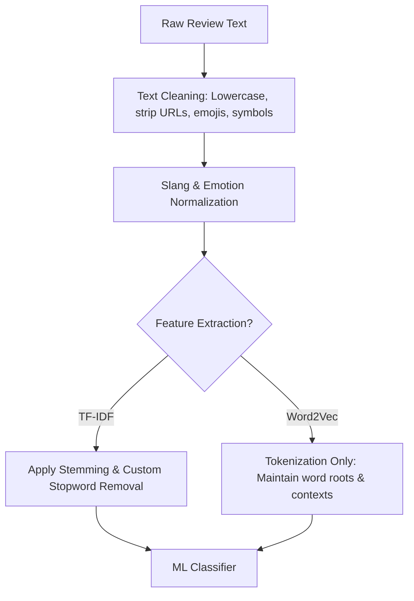

# 04 — Preprocessing Pipeline

## Adapting Text Cleansing for Emotional Nuance

---

## 4.1 Key Differences from Sentiment Preprocessing

Sentiment preprocessing can afford to be relatively coarse. Emotion detection, however, is highly sensitive to:
1. **Intensifiers** (e.g., "*sangat*", "*banget*", "*sekali*") which distinguish mild feelings from intense emotions (e.g., Dislike vs. Disgust, or Annoyance vs. Anger).
2. **Negations** (e.g., "*tidak*", "*belum*", "*jangan*") which completely flip emotional context (e.g., "*tidak takut*" is Neutral/Joy, while "*takut*" is Fear).
3. **Slang words** that carry distinct emotional weight in colloquial Indonesian (e.g., "*kezel*", "*lola*", "*was-was*").

---

## 4.2 Preprocessing Steps

### 1. Cleaning & Lowercasing
- **What to do:** Convert all characters to lowercase. Remove punctuation, URLs, HTML tags, user mentions (`@user`), hashtags (`#topic`), numbers, and emojis.
- **Why it is done:** Normalizes character casing and eliminates features that do not possess generalized emotional meaning, reducing the dimensionality of the vocabulary.

### 2. Slang & Emotion-Specific Normalization
- **What to do:** Update the custom normalization dictionary (from the sentiment project's 180 words) to include informal Indonesian emotional terms and spelling variations.
- **Examples of expansions:**
  - *Anger:* `kesel`, `kezel`, `nyebelin`, `benci`, `gedek` $\rightarrow$ `kesal`
  - *Joy:* `seneng`, `hepi`, `mantap`, `mantul`, `luar biasa` $\rightarrow$ `senang`
  - *Sadness:* `kecewa`, `keciwa`, `sedii`, `nyesel` $\rightarrow$ `kecewa`
  - *Fear:* `khawatir`, `kuatir`, `parno`, `takut`, `was-was` $\rightarrow$ `khawatir`
- **Why it is done:** Play Store reviews are highly informal. Normalizing variations to standard root forms concentrates the emotional signals onto a single vocabulary term, making both TF-IDF and Word2Vec representation more effective.

### 3. Stemming and Stopwords (Conditional Pipeline Logic)

- **IF** the feature extraction method is **TF-IDF**:
  - **Action:** Apply morphological stemming using `PySastrawi`. Remove stopwords using a custom list.
  - **Stopword Constraint:** **Do NOT remove negations** (*tidak, bukan, ga, gak*) **or intensifiers** (*sangat, banget, sekali, amat*). Remove fungsional words (*dan, atau, yang, di, ke*).
  - **Why:** TF-IDF operates on bag-of-words frequencies. Stemming collapses grammatical variations of emotion verbs/adjectives (e.g., *menakutkan*, *ditakuti* $\rightarrow$ *takut*), which reduces feature sparsity. Removing fungsional stopwords prevents noise from dominant grammatical structures.

- **IF** the feature extraction method is **Word2Vec**:
  - **Action:** **Skip stemming**. Do not remove stopwords; only apply tokenization and slang normalization.
  - **Why:** Word2Vec models are trained on word-context associations. Stemming destroys grammatical contexts, verb tenses, and adjectives, reducing the semantic quality of vectors. Retaining the raw, normalized words allows the Word2Vec model to learn distinct vector positions for words like "menakutkan" vs "takut" based on their local contexts.
