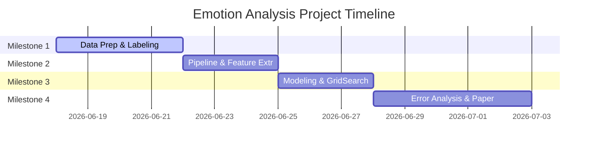

# 09 — Execution Roadmap

## Project Milestones and Execution Plan

---

## 9.1 Phase-Based Execution Plan

The project is structured into four sequential milestones. Each milestone lists **WHAT** to do, **WHY** it is done, and **HOW TO VERIFY** its success.

---

## 9.2 Milestones and Checklists

### Milestone 1: Data Preparation & Labeling (Est: 4 Days)
- **Step 1.1: Dataset Extraction**
  - **What:** Load `data/raw/reviews_playstore_indonesia.csv` and split into Train, Validation, and Test sets using stratified splitting.
  - **Why:** Prevents data leakage from preprocessing or resampling.
- **Step 1.2: Annotation & Inter-Annotator Agreement**
  - **What:** Execute double-blind manual labeling on a sample of 500 reviews. Calculate Cohen's Kappa.
  - **Why:** Verifies the quality and consistency of human annotations before full scaling.
  - **Verification:** Run a script that prints Cohen's Kappa score. Confirm $\kappa \ge 0.60$.
- **Step 1.3: Scaled Labeling & Balancing**
  - **What:** Complete labeling on the entire set. Apply Class Weights or Random Under-Sampling based on the rules in `03_dataset_strategy.md`.
  - **Why:** Prepares the training set to prevent majority-class bias.

### Milestone 2: Preprocessing & Feature Extraction (Est: 3 Days)
- **Step 2.1: Preprocessing Implementation**
  - **What:** Create `src/preprocessing.py` implementing cleaning, slang normalization, and conditional stemming/stopword removal.
  - **Why:** Prepares raw reviews for vectorization according to the rules in `04_preprocessing_pipeline.md`.
  - **Verification:** Run unit tests verifying that "*kezel bgt*" maps to "*kesal*" (stemmed/normalized) and "*tidak takut*" retains "*tidak*".
- **Step 2.2: Feature Vector Generation**
  - **What:** Compute TF-IDF matrices (Unigram, Bigram, Combined) and train/aggregate Word2Vec models (Simple Average, TF-IDF weighted).
  - **Why:** Translates token sequences into numeric inputs for classifiers.
  - **Verification:** Confirm feature array dimensions (e.g. Word2Vec shape is $(N, 100)$, TF-IDF shape is $(N, V)$).

### Milestone 3: Model Training & Evaluation (Est: 3 Days)
- **Step 3.1: Hyperparameter Tuning Grid Search**
  - **What:** Execute `GridSearchCV` on Logistic Regression, LinearSVC, Multinomial Naive Bayes, and Random Forest using 5-fold CV.
  - **Why:** Optimizes parameters for maximum Macro F1-Score.
- **Step 3.2: Model Evaluation**
  - **What:** Evaluate best models on the natural test set. Log classification reports and confusion matrices.
  - **Why:** Measures model performance on representative data.
  - **Verification:** Check that Macro F1 exceeds the Dummy Baseline.

### Milestone 4: Diagnostic Analysis & Paper Writing (Est: 5 Days)
- **Step 4.1: Error Logging & Linguistics**
  - **What:** Extract 100 misclassified reviews, code their error types, and implement mitigation loops if specific errors dominate (see `08_error_analysis_and_linguistics.md`).
  - **Why:** Explains *why* the model fails and provides academic discussion for the paper.
- **Step 4.2: Academic Deliverables Compilation**
  - **What:** Draft the Laporan Paper (15 references), prepare the slides (15 pages), and record the 10-minute presentation video.
  - **Why:** Fulfills the course requirements for CSI-3G3.

---

## 9.3 Model Selection Decision Gate

When finalizing the project codebase, the developer must select the final model using this conditional logic:

- **IF** TF-IDF + Logistic Regression yields the highest Macro F1-Score:
  - **Decision:** Select TF-IDF + Logistic Regression.
  - **Justification for Paper:** The feature coefficients are fully interpretable, and the computation is highly efficient. This proves that lexical keyword matching is highly effective for short Indonesian reviews.
- **IF** Word2Vec + LinearSVC yields the highest Macro F1-Score:
  - **Decision:** Select Word2Vec + LinearSVC.
  - **Justification for Paper:** The semantic embeddings successfully captured similarity across different slang words, overcoming the sparsity limitation of TF-IDF.
- **IF** all ML models achieve Macro F1-Score $< 0.45$:
  - **Decision:** **DO NOT proceed to report writing.** Re-evaluate the labeling guide. This score indicates that the labeling rules are too noisy or class boundaries are poorly defined.
