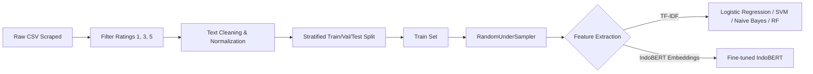
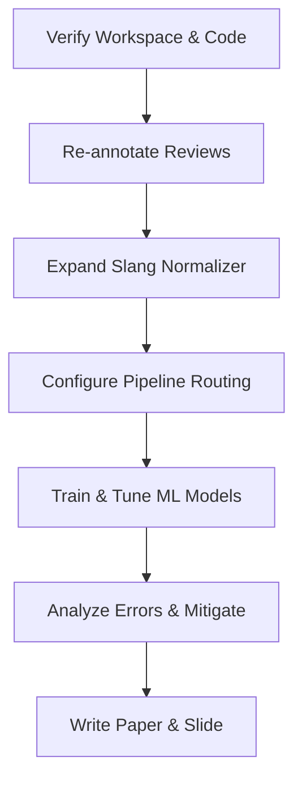

# Technical Audit & Transformation Plan: Sentiment to Emotion Analysis

**Course:** CSI-3G3 Text Mining | CSI-3G3 Penambangan Teks  
**Workspace Corpus:** `Rakanovan9/analisis-sentimen-indobert-playstore`  
**Status:** Undergoing Strategic Restructuring (Transitioning from Topic 1 to Topic 2)  

---

## 1. Project Lineage Verification

We confirm that this repository contains a completed **Sentiment Analysis** project based on Google Play Store reviews for the **Twitter/X** application (`com.twitter.android`). 

### Empirical Evidence from the Directory
1. **Datasets (`data/processed/` and `data/raw/`):** 
   - `data/raw/reviews_playstore_indonesia.csv` contains 49,070 rows of raw scraper output (including raw rating values 1, 3, and 5).
   - In `data/processed/`, we find stratified, deduplicated files (`train.csv`, `val.csv`, `test.csv`). The validation and test sets reflect natural distributions where negative reviews make up ~65%, positive reviews ~29%, and neutral reviews ~7%. 
2. **Metadata and Model Artifacts (`models/`):**
   - Serialized vectorizers (`tfidf_*.joblib`) and model binary `best_ml_model.joblib`.
   - Key metadata: `best_ml_model_info.joblib` and `indobert_model_info.joblib`.
   - Pre-trained IndoBERT files under `models/indobert_sentiment/`.
3. **Exploratory Visualizations (`reports/figures/`):**
   - Word clouds specifically grouped under three titles: `wordcloud_negatif.png`, `wordcloud_netral.png`, and `wordcloud_positif.png`.
   - Model accuracy graphs and classification plots reflecting the three-class sentiment task (Positive, Negative, Neutral).
4. **Codebase Context (`README.md` and `docs/`):**
   - The `README.md` title explicitly states: *"Perbandingan Model Machine Learning dan IndoBERT untuk Analisis Sentimen Ulasan Aplikasi Twitter/X di Google Play Store"*.
   - Section 1 of the README details mapping ratings directly to sentiment: Rating 1 $\rightarrow$ Negative, Rating 3 $\rightarrow$ Neutral, and Rating 5 $\rightarrow$ Positive (discarding ratings 2 and 4 to clean label boundaries).

### Validation Conclusion
The lineage is unambiguous. This project is a complete, three-class classification pipeline designed to distinguish positive, negative, and neutral attitudes. There are no preexisting structures for fine-grained psychological emotions (e.g., Joy, Sadness, Anger), rendering this audit and transformation plan critical for moving to the new topic.

---

## 2. Previous Project Recap (Sentiment Analysis)

The sentiment analysis project succeeded in establishing a robust baseline and transformer pipeline. Below is the reconstruction of that pipeline:



### 2.1 Pipeline Components and Design Rationale

#### A. Data Sourcing and Weak Labeling
* **What was done:** 49,070 Indonesian reviews of Twitter/X were scraped using `google-play-scraper`. Users' rating stars were used as a weak supervision signal (Rating 1 $\rightarrow$ Negative, 3 $\rightarrow$ Neutral, 5 $\rightarrow$ Positive). Ratings 2 and 4 were discarded.
* **Why it was done:** Manual labeling of 49,000+ reviews is practically impossible within typical time frames. Distant supervision using rating stars provides a noisy but highly scalable labeling source. Ratings 2 and 4 were discarded because empirical analysis of sentiment lexicons showed they were full of mixed sentiments, which would inject high label noise into the boundary zones.
* **Trade-offs:** 
   - *Pros:* Large volume of training data, zero annotation cost.
   - *Cons:* Rating stars do not always match text sentiment (e.g., a user writes "*aplikasi hancur, error terus*" but accidentally taps 5 stars). This introduces label noise that limits the models' performance ceilings.

#### B. Preprocessing Pipelines
* **What was done:** Two separate pipelines were created:
  - **For ML Models:** Text cleaning (removing emojis, links, mentions), slang normalization using a custom 180-word dictionary, morphological stemming via `PySastrawi`, and stopword removal.
  - **For IndoBERT:** Text cleaning and slang normalization only. Stemming and stopword removal were skipped.
* **Why it was done:** Traditional ML bag-of-words models (TF-IDF) suffer from the curse of dimensionality and feature sparsity. Stemming and stopword removal reduce vocabulary size and group similar root words, making frequency metrics more descriptive. Transformers (IndoBERT), however, rely on contextual attention mechanisms. Removing stopwords or altering word roots breaks the semantic relationships and grammatical structures that BERT uses to construct attention matrices.
* **Trade-offs:** 
   - *Pros:* Maximized performance for each model family.
   - *Cons:* Dual-pipeline architecture increases codebase complexity and training infrastructure overhead.

#### C. Feature Extraction
* **What was done:** TF-IDF (Unigram, Bigram, and Combined) and averaged Word2Vec embeddings (trained from scratch on the corpus) were evaluated.
* **Why it was done:** TF-IDF serves as a frequency baseline, capturing key sentiment-carrying keywords. Word2Vec was evaluated to see if vector representations capturing semantic similarities could improve classification generalization.
* **Trade-offs:** 
   - *Pros:* Comprehensive comparison of statistical vs. distributed representations.
   - *Cons:* Word2Vec was trained from scratch on a relatively small balanced dataset (~4,800 reviews), yielding lower-quality embeddings than pre-trained equivalents and underperforming relative to TF-IDF.

#### D. Modeling and Training Strategy
* **What was done:** Trained baseline classifiers (Logistic Regression, LinearSVC, Multinomial Naive Bayes, Random Forest) tuned with `GridSearchCV` on a balanced training set (under-sampled using `RandomUnderSampler` to ~1,600 samples per class). Evaluated against a fine-tuned IndoBERT (`indolem/indobert-base-uncased`) trained on GPU with mixed-precision.
* **Why it was done:** Balance in training data prevents models from defaulting to the majority class. Traditional models are fast and explainable, while IndoBERT captures deep contextual subtleties.
* **Trade-offs:**
   - *Pros:* Strong mitigation against class imbalance in the training phase.
   - *Cons:* Undersampling threw away roughly 35,000 reviews from the majority class (Negative), potentially limiting the vocabulary diversity the model could learn.

#### E. Evaluation Metrology
* **What was done:** Model performance was assessed on validation and test sets that retained their natural, unbalanced distribution. Macro F1-Score was used as the primary metric, supported by per-class Precision, Recall, and Confusion Matrices.
* **Why it was done:** Keeping validation/test sets in their natural distribution ensures that the metrics reflect real-world performance. Macro F1-Score treats classes equally, exposing whether the model is failing on the minor class (Neutral, ~7% of data).
* **Trade-offs:** 
   - *Pros:* Mathematically rigorous, honest evaluation that avoids accuracy inflation.
   - *Cons:* Low validation volume for the Neutral class makes the final Macro F1 score highly sensitive to small variations in Neutral predictions.

---

## 3. Limitations of Sentiment Analysis

Sentiment analysis categorizes human expression into positive, negative, or neutral buckets. However, this simplification is insufficient for complex user feedback:

1. **Emotional Flattening (Loss of Specificity):**
   - *Example:* Review A says, "*Aplikasi penipu! Data saya tiba-tiba hilang.*" Review B says, "*Bosan banget sama tampilannya, ga ada yang baru.*"
   - *Sentiment Analysis:* Both reviews are labeled **Negative**.
   - *Why this is insufficient:* Review A conveys **Fear** and **Anger** (security threat, structural failure), which requires immediate customer support intervention. Review B conveys **Disgust/Boredom** (aesthetic fatigue), which requires product feature updates. Treating them identically slows operational response times.
2. **Ambiguity of Neutral Sentiments:**
   - Sentiment analysis struggles to differentiate factual reviews, suggestions, and lack of emotion. A suggestion like "*Tolong tambahkan fitur edit foto*" is labeled Neutral, but it is driven by a desire for improvement (**Joy/Hope** or **Sadness/Disappointment** with current limits).
3. **Contextual Misalignment:**
   - Sentiments do not map to user satisfaction. A highly emotional user can rate an app negative due to frustration (**Anger**), yet still love the app overall (**Joy**). Sentiment analysis flattens these distinct emotional vectors.

---

## 4. Transition Objective (Very Important)

The objective is to pivot the project to **Emotion Analysis** as defined by Topic 2 of the CSI-3G3 syllabus:
> **“Analisis emosi dengan menerapkan word embedding, TF-IDF serta model Machine Learning sebagai perbandingan.”**

```
+-------------------------------------------------------------------------------+
|                        SCOPE TRANSITION SUMMARY                               |
|                                                                               |
|   Sentiment Analysis [Topic 1]       --->        Emotion Analysis [Topic 2]   |
|   - 3 coarse classes                             - 5 fine-grained classes     |
|   - ML + Deep Learning (IndoBERT)                - ML + Word Embeddings ONLY  |
|   - Distant Supervision (Ratings)                - Lexicon/Manual Labels      |
+-------------------------------------------------------------------------------+
```

### Critical Scope Modifications & Why They Matter

1. **Class Expansion (3 Coarse Classes $\rightarrow$ 5 Fine-grained Classes):**
   - *What:* Map texts to Joy, Anger, Sadness, Fear, and Disgust.
   - *Why:* Drastically increases classification difficulty. Random chance drops from 33% to 20%. Boundaries between emotions (e.g., Anger vs. Disgust) are far more fuzzy than positive vs. negative.
2. **Exclusion of Deep Learning (No Transformer Fine-tuning):**
   - *What:* The scope shifts from comparing ML to IndoBERT, to **comparing TF-IDF vs. Word Embeddings (Word2Vec) using ML classifiers only**.
   - *Why:* Matches the specific syllabus requirement for Topic 2, reducing the need for GPU compute and shifting focus to representational comparisons (sparse lexical frequencies vs. dense semantic coordinates).
3. **Ineffectiveness of Star Ratings:**
   - *What:* We can no longer rely on rating stars for distant supervision labeling.
   - *Why:* Emotions are highly contextual. A 1-star review is equally likely to be Anger, Sadness, or Fear. Manual annotation or high-fidelity emotion lexicons are mandatory.
4. **Extreme Class Imbalance:**
   - *What:* In application reviews, Anger and Joy are highly prevalent, while Fear and Disgust are rare.
   - *Why:* Requires sophisticated class-weighting and evaluation designs to ensure minority classes are not ignored by the model.

---

## 5. Required Changes in the Pipeline

To transition the project architecture, every pipeline stage must be adapted:

```
                  REQUIRED PIPELINE ADAPTATIONS
┌──────────────────┬──────────────────────────────────────────────────────────┐
│ Pipeline Stage   │ Key Change & Technical Rationale                         │
├──────────────────┼──────────────────────────────────────────────────────────┤
│ A. Data          │ Manual/Lexicon annotation replacing rating stars.        │
│                  │ Prevents arbitrary labeling mapping.                     │
├──────────────────┼──────────────────────────────────────────────────────────┤
│ B. Preprocessing │ Whitelist intensifiers/negations; extend slang maps.      │
│                  │ Preserves emotional intensity shifts and slang.          │
├──────────────────┼──────────────────────────────────────────────────────────┤
│ C. Modeling      │ Retain ML models; adapt feature compatibility rules.      │
│                  │ Prevents training errors (e.g. negative values in MNB).   │
├──────────────────┼──────────────────────────────────────────────────────────┤
│ D. Training      │ Switch to Class Weights instead of under-sampling.       │
│                  │ Retains rare emotion vocabulary in sparse datasets.      │
├──────────────────┼──────────────────────────────────────────────────────────┤
│ E. Evaluation    │ Set Macro F1 as target; evaluate with 5x5 matrices.     │
│                  │ Mitigates accuracy inflation due to class imbalance.     │
└──────────────────┴──────────────────────────────────────────────────────────┘
```

### 5.1 Stage-by-Stage Breakdown

#### A. Data Pipeline
* **What must change:** Transition from rating-based weak supervision to manual annotator consensus or emotion-lexicon matching (using translated NRC or EmoT datasets).
* **Why:** Rating stars cannot differentiate why a user left a 1-star review (Anger vs. Sadness vs. Fear).

#### B. Preprocessing Pipeline
* **What must change:** 
  1. Add emotion-carrying words to the custom slang normalizer (e.g., mapping *kezel, kzyl* to *kesal*).
  2. Implement conditional stemming and stopword removal: **Apply stemming and stopword removal for TF-IDF** (retaining negations and intensifiers like *sangat, banget*), but **skip stemming and stopword removal for Word2Vec**.
* **Why:** Word2Vec requires structural word context to construct vectors. Stemming collapses words like "*menakutkan*" (scary, Fear) and "*takut*" (afraid, Fear) into "*takut*", which benefits frequency-based TF-IDF by reducing sparsity, but reduces vector richness for Word2Vec.

#### C. Modeling Pipeline
* **What must change:** Keep the core ML estimators (Logistic Regression, LinearSVC, Random Forest, Multinomial Naive Bayes) but implement a **representation routing rule**: MNB is incompatible with Word2Vec representations. MNB can only be run on TF-IDF.
* **Why:** Word2Vec embeddings contain negative numbers (spatial coordinates). Multinomial Naive Bayes relies on probability calculations that require non-negative inputs. Training MNB on negative inputs will crash the pipeline.

#### D. Training Strategy
* **What must change:** Transition from training set undersampling (`RandomUnderSampler`) to algorithmic class weighting (`class_weight='balanced'`) in model loss functions. Optimize parameters using stratified 5-fold cross-validation targeting **Macro F1-Score**.
* **Why:** Under-sampling on a small, annotated emotion dataset throws away valuable, rare vocabulary. Class weighting keeps all samples while scaling the loss penalties based on class rarity, forcing the optimizer to learn boundaries for rare emotions without discarding data.

#### E. Evaluation Pipeline
* **What must change:** 
  1. Replace the 3-class confusion matrix with a $5 \times 5$ normalized confusion matrix.
  2. Set Macro F1-Score as the absolute model selection metric. 
  3. Validate using a human-labeled natural validation set.
* **Why:** Accuracy is highly inflated under severe class imbalance. If 80% of reviews are Joy, a model predicting Joy everywhere gets 80% accuracy but fails completely. Macro F1 treats all classes equally, exposing poor performance on minority classes.

---

## 6. Decision Framework (A/B/C $\rightarrow$ X/Y/Z)

To handle production scenarios during model training and validation, we establish the following decision framework:

### Scenario A: Model performs well after label expansion
* **Condition:** Best model achieves Macro F1 $\ge 0.60$ on the test set, with balanced per-class F1 scores.
* **Action (X):** 
  1. Finalize the model (Logistic Regression + TF-IDF, or SVM + Word2Vec).
  2. Proceed to extract feature weights (if Logistic Regression) to identify the top 15 emotional indicators per class for the paper.
  3. Compile reports and record the presentation video.
* **Why:** A Macro F1 $\ge 0.60$ is highly competitive for 5-class emotion classification in informal Indonesian. It indicates stable classification boundaries.

### Scenario B: Model struggles with class confusion
* **Condition:** Confusion matrix shows heavy overlap ($> 20\%$) between specific emotion pairs (e.g., Anger $\leftrightarrow$ Disgust or Sadness $\leftrightarrow$ Fear).
* **Action (Y):**
  1. Halt pipeline execution.
  2. Conduct a lexical audit: print the top features in the confused classes. Check if terms like "*kecewa*" (disappointed) are present in the *Anger* training data.
  3. Update the normalization mappings in `src/preprocessing.py` to separate emotional triggers, or enforce a stricter hierarchical labeling rule (e.g., if both anger and disgust keywords exist, Anger overrides Disgust).
* **Why:** Lexical overlap in bag-of-words representation directly causes decision boundary overlap. Disambiguating terms at the preprocessing stage resolves model confusion.

### Scenario C: Severe imbalance / poor generalization
* **Condition:** Validation/Test Macro F1 is low ($< 0.45$) due to near-zero F1-scores on minority classes (*Fear* and *Disgust*).
* **Action (Z):**
  1. Reject model configurations.
  2. Do not use Random Under-Sampling.
  3. Implement data augmentation for minority classes: apply synonym replacement using Word2Vec similarity searches on the minority training reviews to triple their representation.
  4. Ensure the loss function uses class weighting (`class_weight='balanced'`).
* **Why:** When minority samples are extremely rare, the model lacks sufficient signal to establish a margin. Augmenting minor classes via semantic synonym replacement provides the classifier with variations of rare contexts without changing their core meanings.

---

## 7. Risk & Edge Case Analysis

Emotion classification is prone to severe edge cases due to the complexity of human expression.

### 1. Sarcasm
* **Problem:** Negative user feedback wrapped in positive vocabulary.
  - *Example:* "*Bagus sekali update-nya, langsung ga bisa log-in.*"
* **Impact:** Classifiers relying on unigram features misclassify the text as **Joy** due to the dominant weight of "*bagus*".
* **Countermeasure:** Evaluate Bigram TF-IDF models and TF-IDF weighted Word2Vec.
* **Why it works:** Bigram combinations capture the inversion of meaning (e.g., pairing "*bagus*" with "*langsung ga bisa*"). Weighted Word2Vec dilutes the vector contribution of common positive words when surrounded by technical errors.

### 2. Overlapping Emotion Labels (Multi-Emotion Reviews)
* **Problem:** Users often express multiple distinct emotions in a single review.
  - *Example:* "*Kecewa banget [Sadness], aplikasinya lemot dan bikin kesel [Anger].*"
* **Impact:** Forcing multi-emotion reviews into a single label during training introduces noise and degrades the classifier's ability to learn clean boundaries.
* **Countermeasure:** Define a strict hierarchical sorting rule during data prep: `Anger > Sadness > Disgust > Fear > Joy`.
* **Why it works:** Provides consistent training signals by prioritizing actionable feedback (Anger) over passive feedback (Sadness), maintaining a single-label structure without confusing the model.

### 3. Annotation Bias (Dataset Noise)
* **Problem:** Subjectivity in human annotations leads to low inter-annotator agreement.
* **Impact:** Inconsistent labeling across the training set introduces random noise, preventing the model from converging.
* **Countermeasure:** Require double-blind annotation on the validation and test sets. Calculate Cohen's Kappa. If $\kappa < 0.60$, resolve disputes via a consensus session.
* **Why it works:** Ensures the evaluation metrics are calculated on clean, verified labels, establishing a reliable ground truth.

---

## 8. Design Justification

We justify our primary architectural adjustments below:

> [!IMPORTANT]
> **Design Decision 1: Using Class Weights instead of Random Under-Sampling**  
> *Justification:* Because our target emotion dataset is manually labeled or lexicon-filtered, the total volume of training data is smaller than the original scraped corpus. Applying under-sampling would throw away critical training samples from majority classes to match the rare classes. Using class weights (`class_weight='balanced'`) keeps all training data while adjusting the loss function penalty, preserving vocab diversity while addressing class imbalance.

> [!NOTE]
> **Design Decision 2: Skipping Stemming for Word2Vec Embeddings**  
> *Justification:* Word2Vec learns representations by analyzing the context surrounding a word. Morphological variations in Indonesian (e.g., prefixing/suffixing: *menakutkan*, *ketakutan*, *ditakuti*) represent semantic differences. Running PySastrawi stemming collapses these to the root "*takut*", which benefits frequency-based TF-IDF models by reducing sparsity, but reduces vector richness for Word2Vec.

> [!WARNING]
> **Design Decision 3: Rejecting Multinomial Naive Bayes for Word2Vec Pipelines**  
> *Justification:* Multinomial Naive Bayes is designed for count-based, non-negative inputs (such as word frequencies or TF-IDF weights). Word2Vec represents words as coordinates in a continuous vector space, which contains negative numbers. Attempting to fit MNB on negative inputs causes mathematical and runtime errors. We restrict MNB to the TF-IDF feature pipeline.

---

## 9. Project Readiness for Transition

We assess the current state of the workspace for this transition:

```
                            REUSABILITY METRIC
┌─────────────────────────────────┬───────────┬───────────────────────────────┐
│ Code/Data Module                │ Reusable? │ Action Required               │
├─────────────────────────────────┼───────────┼───────────────────────────────┤
│ raw/reviews_playstore_...csv    │ 100%      │ Keep as raw text source.      │
│ processed/train, val, test.csv  │ 0%        │ Delete. Labels must be redone.│
│ notebooks/01_scraping.ipynb     │ 100%      │ Reuse for scraping.           │
│ notebooks/02_eda.ipynb          │ 40%       │ Modify for multi-class.       │
│ notebooks/03_preprocessing.ipynb│ 50%       │ Modify normalizer.            │
│ notebooks/04_feature_...ipynb   │ 60%       │ Keep TF-IDF/W2V; remove BERT. │
│ notebooks/05_modeling_ml.ipynb  │ 70%       │ Keep classifiers; tune weights│
│ notebooks/06_modeling_bert.ipynb│ 0%        │ Delete (out of scope).        │
│ notebooks/07_analysis.ipynb     │ 30%       │ Modify for 5x5 diagnostics.   │
│ src/verify_labels.py            │ 20%       │ Rebuild for emotion labels.   │
└─────────────────────────────────┴───────────┴───────────────────────────────┘
```

### 9.1 What Can Be Reused
1. **Raw Scraper Scripts (`notebooks/01_scraping.ipynb`):** The code for scraping Google Play Store reviews using `google-play-scraper` is fully functional and can collect additional data if needed.
2. **ML Modeling Code (`notebooks/05_modeling_ml.ipynb`):** The core pipelines for Logistic Regression, SVM, and Random Forest can be reused, requiring adjustments only to hyperparameter grids and class weight settings.

### 9.2 What Must Be Rebuilt
1. **Processed Datasets (`data/processed/`):** The current splits must be deleted. They contain sentiment labels mapped from rating stars. The data must be re-labeled for fine-grained emotions.
2. **Preprocessing Normalizer (`src/preprocessing.py`):** The 180-word slang dictionary must be expanded to normalize Indonesian emotional slang.
3. **Evaluation and Analysis Scripts (`notebooks/07_analysis.ipynb` and `src/verify_labels.py`):** The 3-class metrics, word clouds, and confusion matrices must be replaced with 5-class equivalents.
4. **IndoBERT Pipeline (`notebooks/06_modeling_bert.ipynb`):** This notebook is deprecated and must be removed to match the Topic 2 scope (ML + Word Embeddings only).

---

## 10. Final Strategic Summary

We propose a direct, structured plan to execute this transition:



### 10.1 Priority Action Plan

1. **Step 1: Dataset Re-labeling (Days 1–4)**
   - Extract raw text reviews. Establish a 5-class labeling protocol. Annotate a train/validation/test split manually or using high-precision lexicon filters. Measure Cohen's Kappa on validation sets.
2. **Step 2: Slang Dictionary Expansion (Days 5–6)**
   - Update `src/preprocessing.py` to map informal emotional slang to standard Indonesian root terms.
3. **Step 3: Pipeline Routing Implementation (Day 7)**
   - Configure a conditional preprocessing router: apply Sastrawi stemming for the TF-IDF feature pipeline, but skip stemming for the Word2Vec pipeline.
4. **Step 4: Comparative Model Training (Days 8–9)**
   - Train Logistic Regression, SVM, and Random Forest. Run Grid Search optimizing for Macro F1. Compare TF-IDF representations against Word2Vec aggregations. Exclude Naive Bayes from Word2Vec pipelines.
5. **Step 5: Error Analysis & Deliverables (Days 10–12)**
   - Generate a $5 \times 5$ confusion matrix. Classify errors, apply dictionary adjustments if slang/negation errors dominate, and compile the final paper, slides, and presentation video.
